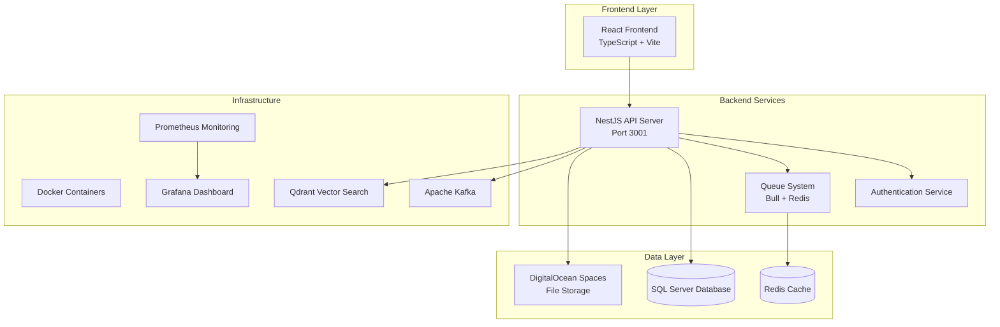
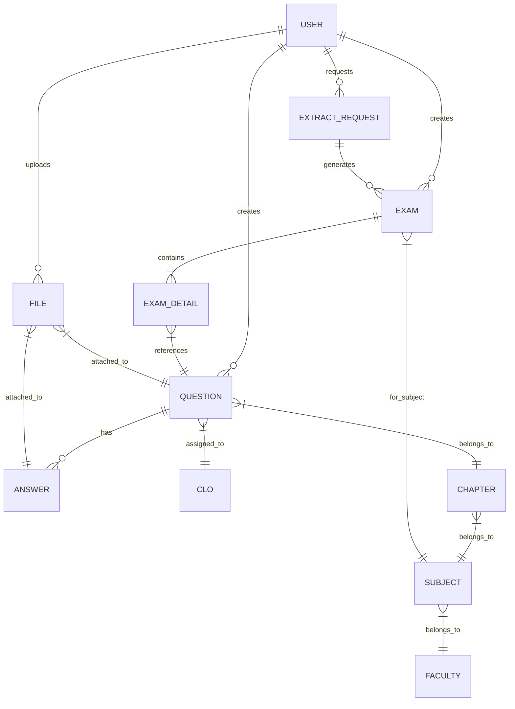
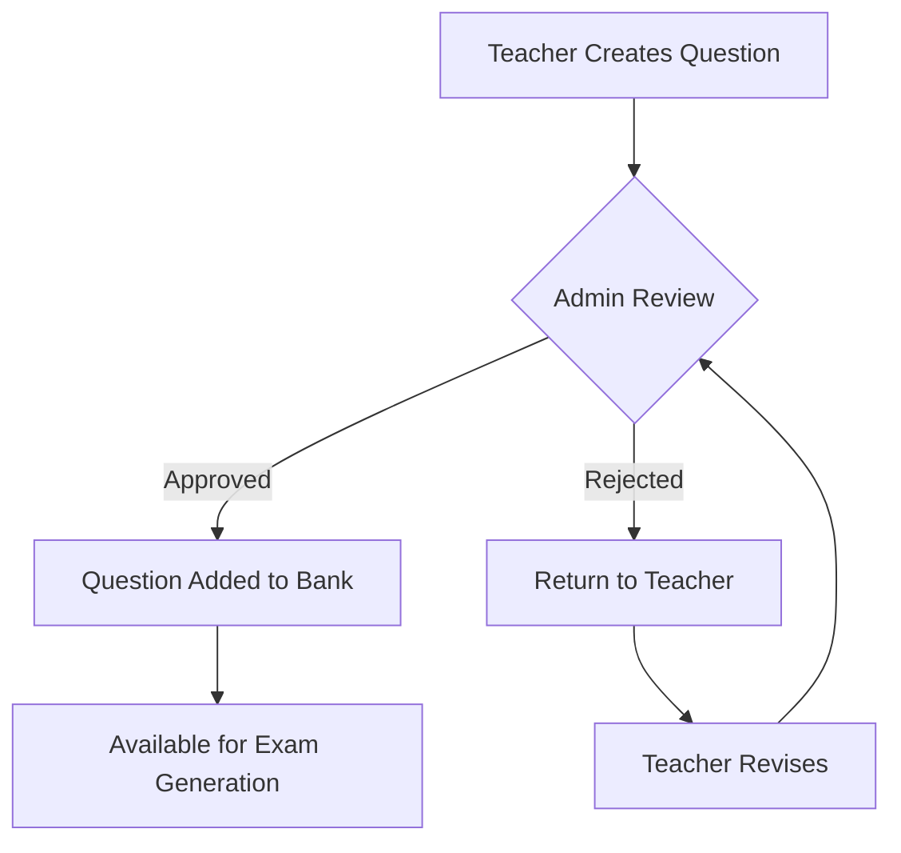
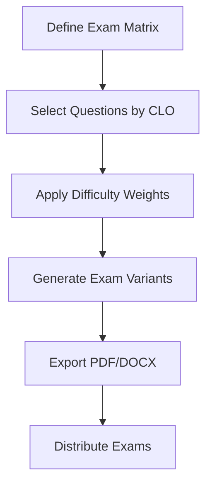

# Graduation System - Question Bank & Exam Management

A comprehensive educational system for managing question banks and generating exams, built with modern microservices architecture. The system consists of two main applications: Question Bank System (App A) for question management and Exam System (App B) for exam generation and export.

## 🏗️ System Architecture



## 🚀 Technology Stack

### Backend
- **Framework**: NestJS (TypeScript)
- **Database**: SQL Server with TypeORM
- **Authentication**: JWT with Passport
- **File Processing**: Python scripts for document parsing
- **Queue System**: Bull with Redis
- **File Storage**: DigitalOcean Spaces
- **Package Manager**: pnpm

### Frontend
- **Framework**: React 18 with TypeScript
- **Build Tool**: Vite
- **UI Components**: Material-UI, Ant Design, Radix UI
- **Styling**: Tailwind CSS
- **Math Rendering**: KaTeX, MathLive
- **Rich Text**: React Quill

### Infrastructure
- **Containerization**: Docker & Docker Compose
- **Message Queue**: Apache Kafka
- **Search Engine**: Qdrant (Vector Search)
- **Monitoring**: Prometheus + Grafana
- **Caching**: Redis

## 📋 Prerequisites

- **Node.js**: >= 18.0.0
- **pnpm**: >= 8.0.0
- **SQL Server**: 2019 or later
- **Python**: >= 3.8 (for document processing)
- **Docker**: >= 20.10 (optional, for containerized deployment)

## 🛠️ Installation

### 1. Clone Repository
```bash
git clone <repository-url>
cd Graduation
```

### 2. Backend Setup
```bash
cd backend

# Install dependencies
pnpm install

# Setup environment configuration
pnpm run setup:env

# Configure database connection
pnpm run db:switch
```

### 3. Frontend Setup
```bash
cd frontend

# Install dependencies
pnpm install
```

### 4. Database Setup
```bash
# Run database migrations
cd database/migrations
# Execute SQL files in order:
# 1. add-nguoi-tao-to-cau-hoi.sql
# 2. create-cau-hoi-cho-duyet-table.sql
```

## ⚙️ Configuration

### Environment Variables

Create `.env` file in backend directory:

```env
# Database Configuration
DB_ENV=local
DB_HOST=localhost
DB_PORT=1433
DB_USERNAME=sa
DB_PASSWORD=your_password
DB_DATABASE=question_bank
DB_ENCRYPT=false
DB_TRUST_SERVER_CERTIFICATE=true

# JWT Configuration
JWT_SECRET=your_jwt_secret
JWT_EXPIRATION=1h

# File Storage (DigitalOcean Spaces)
SPACES_ENDPOINT=region.digitaloceanspaces.com
SPACES_BUCKET=graduation-media
SPACES_ACCESS_KEY=your_access_key
SPACES_SECRET_KEY=your_secret_key
SPACES_REGION=fra1

# Application Settings
NODE_ENV=development
PUBLIC_URL=http://localhost:3001
STORAGE_PROVIDER=spaces
```

### Database Switching
```bash
# Switch to local database
pnpm run db:local

# Switch to server database
pnpm run db:server

# Check current database status
pnpm run db:status

# Test database connection
pnpm run db:test
```

## 🚀 Running the Application

### Development Mode

#### Backend
```bash
cd backend
pnpm run dev
# Server runs on http://localhost:3001
# Swagger API docs: http://localhost:3001/api
```

#### Frontend
```bash
cd frontend
pnpm run dev
# Application runs on http://localhost:3000
```

### Docker Deployment
```bash
# Start all services
docker-compose up -d

# View logs
docker-compose logs -f

# Stop services
docker-compose down
```

## 🎯 Core Features

### Question Bank System (App A)
- **Question Management**: Create, edit, delete questions with multiple choice answers
- **Word Import**: Import questions from Word documents with multimedia support
- **Approval Workflow**: Teacher submissions require admin approval
- **Multimedia Support**: Images, audio files, LaTeX formulas
- **CLO Assignment**: Map questions to Course Learning Outcomes
- **Chapter Organization**: Organize questions by subjects and chapters

### Exam System (App B)
- **Exam Generation**: Create exams using matrix-based question selection
- **Bulk Generation**: Generate multiple exam variants from single matrix
- **Export Options**: PDF and DOCX export with HUTECH template
- **Answer Shuffling**: Randomize answer order (configurable)
- **Integration API**: Seamless data exchange between systems

### User Management
- **Role-Based Access**: Admin and Teacher roles with specific permissions
- **Authentication**: JWT-based secure authentication
- **Department Isolation**: Teachers can only access their department data

## 📁 Project Structure

```
Graduation/
├── backend/                 # NestJS API server
│   ├── src/
│   │   ├── entities/       # TypeORM entities
│   │   ├── modules/        # Feature modules
│   │   ├── services/       # Business logic
│   │   └── config/         # Configuration files
│   ├── uploads/            # File uploads
│   └── output/             # Generated files
├── frontend/               # React application
│   ├── src/
│   │   ├── components/     # Reusable components
│   │   ├── pages/          # Page components
│   │   └── services/       # API services
├── database/               # Database files
│   ├── migrations/         # SQL migration files
│   ├── scripts/            # Database scripts
│   └── seeds/              # Seed data
├── docs/                   # Documentation
├── scripts/                # Utility scripts
└── template/               # Document templates
```

## 🔌 API Endpoints

### Authentication
- `POST /auth/login` - User login
- `POST /auth/logout` - User logout
- `GET /auth/profile` - Get user profile

### Question Management
- `GET /cau-hoi` - List questions
- `POST /cau-hoi` - Create question
- `PUT /cau-hoi/:id` - Update question
- `DELETE /cau-hoi/:id` - Delete question

### Exam Management
- `POST /de-thi/generate` - Generate exam
- `POST /de-thi/bulk-generate` - Bulk generate exams
- `GET /de-thi/:id/export/pdf` - Export PDF
- `GET /de-thi/:id/export/docx` - Export DOCX

### Integration API
- `GET /integration/exam/:id/details` - Get exam details
- `GET /integration/exam/:id/status` - Get exam status

## 📊 Database Schema



### Key Entities
- **User**: System users (Admin/Teacher roles)
- **Khoa**: Faculties/Departments
- **MonHoc**: Subjects within faculties
- **Phan**: Chapters within subjects
- **CauHoi**: Questions with metadata
- **CauTraLoi**: Multiple choice answers
- **DeThi**: Generated exams
- **ChiTietDeThi**: Exam-question relationships
- **CLO**: Course Learning Outcomes
- **Files**: Multimedia attachments

## 🧪 Testing

### Backend Tests
```bash
cd backend

# Run unit tests
pnpm run test

# Run tests with coverage
pnpm run test:cov

# Run e2e tests
pnpm run test:e2e
```

### API Testing
```bash
# Test API endpoints
pnpm run test:api

# Test database connection
pnpm run db:test
```

## 🚀 Deployment

### Digital Ocean Deployment

1. **Server Setup**
```bash
# Run setup script
./scripts/setup-digitalocean.sh
```

2. **Environment Configuration**
- Configure production environment variables
- Set up DigitalOcean Spaces for file storage
- Configure database connection

3. **Application Deployment**
```bash
# Build applications
cd backend && pnpm run build
cd frontend && pnpm run build

# Deploy using Docker
docker-compose -f docker-compose.prod.yml up -d
```

### Production Environment Variables
```env
NODE_ENV=production
DB_ENV=server
PUBLIC_URL=https://your-domain.com
SPACES_ENDPOINT=region.digitaloceanspaces.com
CDN_BASE_URL=https://graduation-media.region.cdn.digitaloceanspaces.com
```

## 🔧 Troubleshooting

### Common Issues

1. **Database Connection Failed**
   - Check SQL Server is running
   - Verify connection string in `.env`
   - Run `pnpm run db:test` to test connection

2. **File Upload Issues**
   - Verify DigitalOcean Spaces credentials
   - Check file permissions in uploads directory
   - Ensure CORS settings allow file uploads

3. **Word Import Failures**
   - Install Python dependencies: `pip install python-docx mammoth`
   - Check file format compatibility
   - Verify template structure

4. **Authentication Problems**
   - Check JWT secret configuration
   - Verify user credentials in database
   - Clear browser cache and tokens

### Performance Optimization

1. **Database Optimization**
   - Add indexes for frequently queried fields
   - Optimize complex queries
   - Use database connection pooling

2. **File Storage**
   - Enable CDN for DigitalOcean Spaces
   - Compress images before upload
   - Implement file caching strategies

## 📊 Monitoring

### Prometheus Metrics
- API response times
- Database query performance
- File upload statistics
- User authentication metrics

### Grafana Dashboards
- System performance overview
- User activity monitoring
- Error rate tracking
- Resource utilization

## 🔄 System Workflow

### Question Management Workflow


### Exam Generation Workflow


## 🛡️ Security Features

- **JWT Authentication**: Secure token-based authentication
- **Role-Based Authorization**: Admin and Teacher role separation
- **Input Validation**: Comprehensive data validation using class-validator
- **SQL Injection Prevention**: TypeORM parameterized queries
- **File Upload Security**: File type validation and secure storage
- **CORS Configuration**: Proper cross-origin resource sharing setup

## 📈 Performance Features

- **Database Indexing**: Optimized queries with proper indexes
- **Caching Layer**: Redis caching for frequently accessed data
- **File CDN**: DigitalOcean Spaces CDN for fast file delivery
- **Queue System**: Background processing for heavy operations
- **Connection Pooling**: Efficient database connection management

## 🤝 Contributing

1. Fork the repository
2. Create feature branch: `git checkout -b feature/new-feature`
3. Commit changes: `git commit -am 'Add new feature'`
4. Push to branch: `git push origin feature/new-feature`
5. Submit pull request

### Development Guidelines
- Follow TypeScript best practices
- Write unit tests for new features
- Update documentation for API changes
- Use conventional commit messages
- Ensure code passes linting checks

## 📄 License

This project is licensed under the MIT License - see the [LICENSE](LICENSE) file for details.
