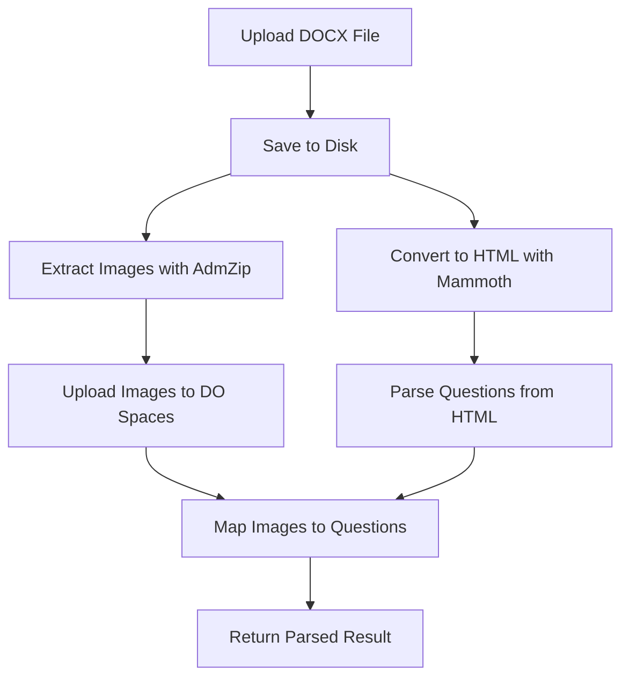

# Enhanced DOCX Parser - Pure Node.js Implementation

**Author:** Linh Dang Dev  
**Created:** 2025-07-10

## Tổng quan

Enhanced DOCX Parser là giải pháp thay thế Python parser hiện tại bằng một implementation thuần Node.js/TypeScript. Parser mới này giải quyết các vấn đề chính:

- ✅ **Image extraction không hoạt động** với Python parser
- ✅ **Dependency phức tạp** (Python + Node.js)
- ✅ **Performance issues** khi gọi Python từ Node.js
- ✅ **LaTeX processing** tốt hơn
- ✅ **Error handling** cải thiện

## Kiến trúc

### Core Technologies

1. **Mammoth.js** - Convert DOCX to HTML với style preservation
2. **AdmZip** - Extract images trực tiếp từ DOCX (ZIP archive)
3. **TypeScript** - Type safety và better development experience
4. **Digital Ocean Spaces** - Upload extracted images

### Workflow



## API Endpoints

### 1. Full Document Parsing

```http
POST /enhanced-docx-parser/parse
Content-Type: multipart/form-data

Parameters:
- file: DOCX file
- processImages: boolean (default: true)
- extractStyles: boolean (default: true) 
- preserveLatex: boolean (default: true)
- maxQuestions: number (default: 100)
```

**Response:**
```json
{
  "success": true,
  "message": "Document parsed successfully",
  "data": {
    "questions": [...],
    "stats": {
      "totalQuestions": 25,
      "groupQuestions": 5,
      "singleQuestions": 20,
      "extractedImages": 8,
      "hasLatex": 12
    },
    "extractedFiles": [...],
    "filePath": "/uploads/questions/..."
  }
}
```

### 2. Image Extraction Only

```http
POST /enhanced-docx-parser/parse-images-only
Content-Type: multipart/form-data

Parameters:
- file: DOCX file
```

**Response:**
```json
{
  "success": true,
  "message": "Images extracted successfully",
  "data": {
    "totalImages": 8,
    "images": [
      {
        "id": "uuid",
        "fileName": "image_uuid.png",
        "originalName": "image1.png",
        "mimeType": "image/png",
        "fileType": 2,
        "size": 45678,
        "preview": "data:image/png;base64,..."
      }
    ]
  }
}
```

### 3. Parser Comparison

```http
POST /enhanced-docx-parser/compare-parsers
Content-Type: multipart/form-data

Parameters:
- file: DOCX file
```

## Tính năng chính

### 1. Image Extraction

- **AdmZip** để extract images từ `word/media/` folder
- Support multiple formats: JPG, PNG, GIF, BMP, SVG, WebP
- Auto-generate unique filenames
- Upload to Digital Ocean Spaces
- Generate CDN URLs cho faster access

### 2. Enhanced Question Parsing

- **Group Questions** detection với `[<sg>]` markup
- **Fill-in-blank** questions với `{<1>}` placeholders
- **LaTeX preservation** với improved patterns
- **Answer detection** với underline formatting
- **HoanVi determination** based on answer patterns

### 3. Mammoth.js Configuration

```typescript
const mammothOptions = {
  styleMap: [
    "u => u", // Preserve underline for correct answers
    "strong => strong",
    "w:rPr/w:u => u", // Word-specific underline formats
    // ... more style mappings
  ],
  preserveStyles: true,
  includeEmbeddedStyleMap: true,
  convertImage: mammoth.images.imgElement(...)
};
```

### 4. LaTeX Processing

Improved LaTeX detection patterns:
- `\command{content}` - LaTeX commands
- `$formula$` - Inline math
- `^superscript` và `_subscript`
- Chemical formulas
- Mathematical symbols

## Testing

### Frontend Test Interface

Truy cập `/test/docx-parser` để test parser:

1. **Full Parsing Test** - Parse toàn bộ document
2. **Image Extraction Test** - Chỉ extract images
3. **Parser Comparison** - So sánh với Python parser

### Test Cases

1. **Basic DOCX** - Simple questions với text
2. **Images DOCX** - Questions có embedded images
3. **LaTeX DOCX** - Mathematical formulas
4. **Group Questions** - Vietnamese group questions
5. **Fill-in-blank** - English comprehension questions

## Performance Comparison

| Metric | Python Parser | Enhanced Parser |
|--------|---------------|-----------------|
| Image Extraction | ❌ Không hoạt động | ✅ Hoạt động tốt |
| Setup Complexity | 🔴 Python + Node.js | 🟢 Chỉ Node.js |
| Processing Speed | 🟡 Chậm (subprocess) | 🟢 Nhanh (native) |
| Error Handling | 🟡 Limited | 🟢 Comprehensive |
| LaTeX Support | 🟡 Basic | 🟢 Enhanced |
| Maintenance | 🔴 Khó | 🟢 Dễ |

## Migration Guide

### 1. Thay thế trong existing code

```typescript
// Old way
const result = await this.docxParserService.parseDocx(filePath, options);

// New way  
const result = await this.enhancedDocxParserService.parseUploadedFile(file, options);
```

### 2. Update imports

```typescript
import { EnhancedDocxParserService } from '../services/enhanced-docx-parser.service';
```

### 3. Module registration

```typescript
@Module({
  imports: [EnhancedDocxParserModule],
  // ...
})
```

## Configuration

### Environment Variables

```env
# Digital Ocean Spaces (for image upload)
DO_SPACES_ENDPOINT=sgp1.digitaloceanspaces.com
DO_SPACES_BUCKET=datauploads
DO_SPACES_ACCESS_KEY=your-access-key
DO_SPACES_SECRET_KEY=your-secret-key
DO_SPACES_CDN=datauploads.sgp1.cdn.digitaloceanspaces.com
```

### Parser Options

```typescript
interface ParseOptions {
  processImages?: boolean;    // Extract images from DOCX
  extractStyles?: boolean;    // Preserve formatting styles
  preserveLatex?: boolean;    // Keep LaTeX expressions
  maxQuestions?: number;      // Limit number of questions
}
```

## Troubleshooting

### Common Issues

1. **"No images extracted"**
   - Check if DOCX contains images in `word/media/` folder
   - Verify supported image formats

2. **"LaTeX not preserved"**
   - Enable `preserveLatex: true` option
   - Check LaTeX pattern matching

3. **"Upload to Spaces failed"**
   - Verify DO Spaces credentials
   - Check network connectivity

### Debug Mode

Enable detailed logging:
```typescript
// In service constructor
this.logger.setLogLevels(['log', 'debug', 'verbose']);
```

## Future Enhancements

1. **Advanced Image Mapping** - Better correlation between images and questions
2. **OCR Integration** - Extract text from images
3. **Equation Recognition** - Convert image equations to LaTeX
4. **Batch Processing** - Handle multiple files simultaneously
5. **Caching** - Cache parsed results for faster re-processing

## Conclusion

Enhanced DOCX Parser cung cấp giải pháp robust và maintainable cho việc parse Word documents trong Question Bank system. Với việc loại bỏ Python dependency và cải thiện image extraction, parser mới này sẽ giải quyết được các vấn đề hiện tại và cung cấp foundation tốt cho future enhancements.
