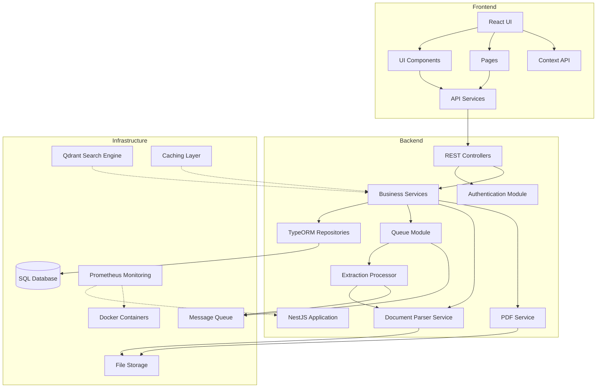
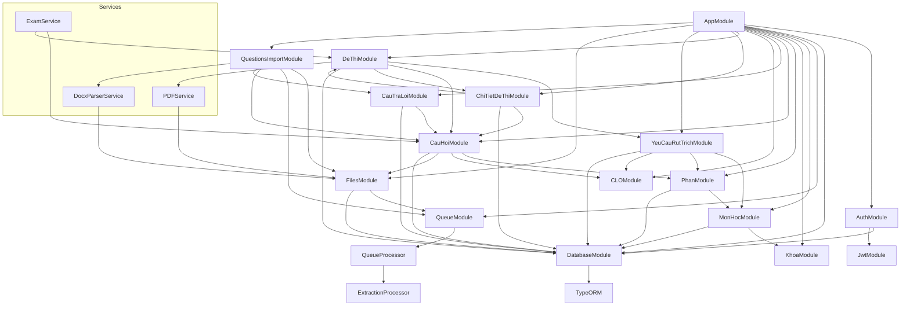
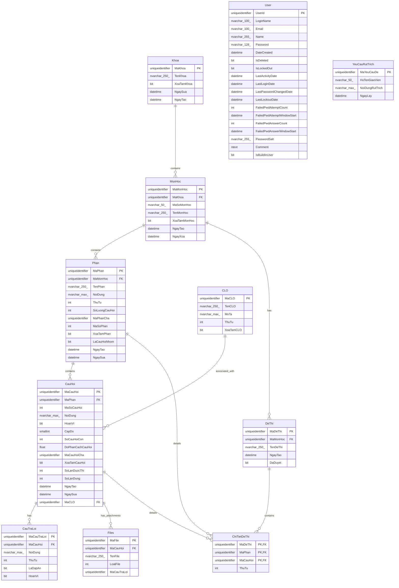
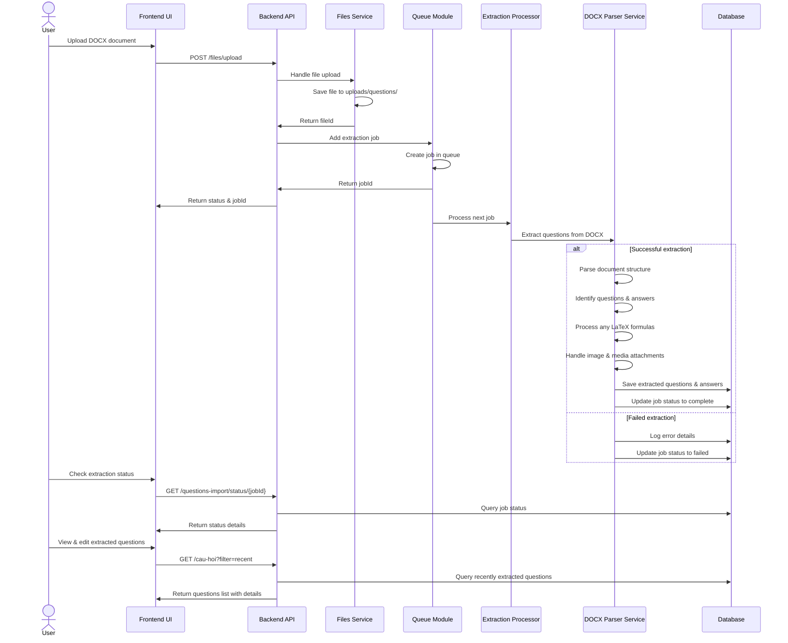
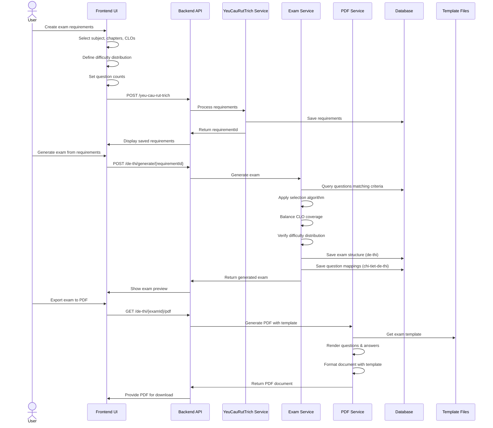
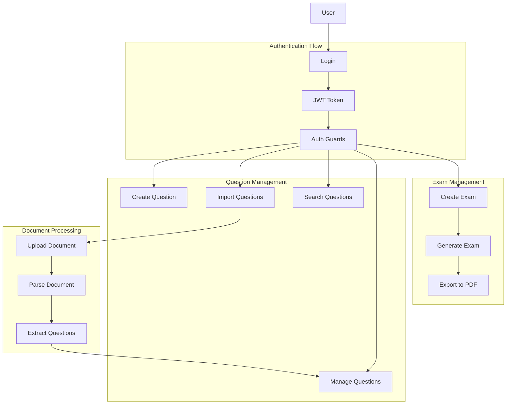
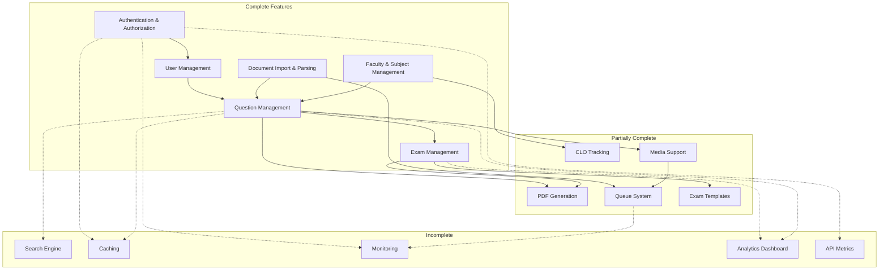
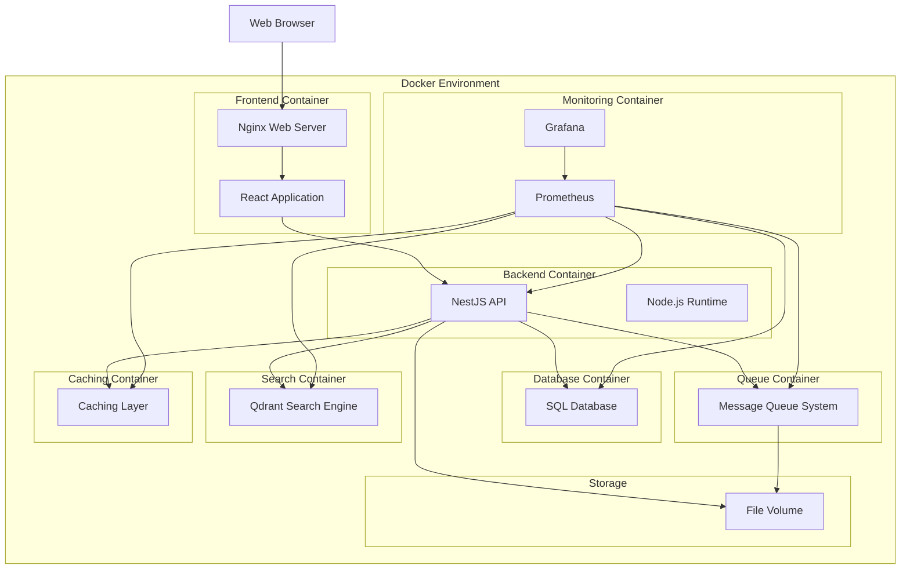

# Graduation Project Documentation

## Technologies Used

**Backend:**
- NestJS (TypeScript) framework
- TypeORM for database operations
- Python for document parsing
- Queue system for background processing
- JWT authentication

**Frontend:**
- React with TypeScript
- Tailwind CSS
- Vite as build tool

**Infrastructure:**
- Docker for containerization
- SQL Database
- Prometheus for monitoring (planned)
- PDF generation services
- Qdrant for search (planned)
- Caching layer (planned)

# Phân tích và thiết kế hệ thống

## 2.2.1 Kiến trúc hệ thống

### 2.2.1.1 Kiến trúc tổng quan

### 2.2.1.2 Kiến trúc Module

## 2.2.2 Thiết kế cơ sở dữ liệu

### 2.2.2.1 Sơ đồ quan hệ thực thể (ERD)

### 2.2.2.2 Mô tả chi tiết các bảng

**Bảng User**
| Tên cột | Kiểu dữ liệu | Mô tả |
|---|---|---|
| UserId | uniqueidentifier | Khóa chính |
| LoginName | nvarchar(100) | Tên đăng nhập |
| Email | nvarchar(100) | Địa chỉ email |
| Name | nvarchar(255) | Tên người dùng |
| Password | nvarchar(128) | Mật khẩu (đã băm) |
| DateCreated | datetime | Ngày tạo tài khoản |
| IsDeleted | bit | Đã xóa hay chưa |
| IsLockedOut | bit | Tài khoản có bị khóa không |
| LastActivityDate | datetime | Ngày hoạt động cuối cùng |
| LastLoginDate | datetime | Ngày đăng nhập cuối |
| LastPasswordChangedDate | datetime | Ngày đổi mật khẩu cuối |
| LastLockoutDate | datetime | Ngày khóa tài khoản cuối |
| FailedPwdAttemptCount | int | Số lần nhập sai mật khẩu |
| FailedPwdAttemptWindowStart | datetime | Thời điểm bắt đầu cửa sổ đếm lỗi MK |
| FailedPwdAnswerCount | int | Số lần nhập sai câu trả lời bí mật |
| FailedPwdAnswerWindowStart | datetime | Thời điểm bắt đầu cửa sổ đếm lỗi câu trả lời |
| PasswordSalt | nvarchar(255) | Chuỗi salt cho mật khẩu |
| Comment | ntext | Ghi chú |
| IsBuildInUser | bit | Là người dùng hệ thống? |

**Bảng Khoa**
| Tên cột | Kiểu dữ liệu | Mô tả |
|---|---|---|
| MaKhoa | uniqueidentifier | Khóa chính |
| TenKhoa | nvarchar(250) | Tên khoa |
| XoaTamKhoa | bit | Đánh dấu xóa tạm |
| NgaySua | datetime | Ngày cập nhật |
| NgayTao | datetime | Ngày tạo |

**Bảng MonHoc**
| Tên cột | Kiểu dữ liệu | Mô tả |
|---|---|---|
| MaMonHoc | uniqueidentifier | Khóa chính |
| MaKhoa | uniqueidentifier | Khóa ngoại đến Khoa |
| MaSoMonHoc | nvarchar(50) | Mã số của môn học |
| TenMonHoc | nvarchar(250) | Tên môn học |
| XoaTamMonHoc | bit | Đánh dấu xóa tạm |
| NgayTao | datetime | Ngày tạo |
| NgayXoa | datetime | Ngày xóa |

**Bảng Phan**
| Tên cột | Kiểu dữ liệu | Mô tả |
|---|---|---|
| MaPhan | uniqueidentifier | Khóa chính |
| MaMonHoc | uniqueidentifier | Khóa ngoại đến Môn học |
| TenPhan | nvarchar(250) | Tên phần/chương |
| NoiDung | nvarchar(max) | Nội dung chi tiết của phần |
| ThuTu | int | Thứ tự của phần |
| SoLuongCauHoi | int | Số lượng câu hỏi trong phần |
| MaPhanCha | uniqueidentifier | Khóa ngoại tự tham chiếu (phần cha) |
| MaSoPhan | int | Mã số của phần |
| XoaTamPhan | bit | Đánh dấu xóa tạm |
| LaCauHoiNhom | bit | Là phần chứa câu hỏi nhóm? |
| NgayTao | datetime | Ngày tạo |
| NgaySua | datetime | Ngày cập nhật |

**Bảng CLO**
| Tên cột | Kiểu dữ liệu | Mô tả |
|---|---|---|
| MaCLO | uniqueidentifier | Khóa chính |
| TenCLO | nvarchar(250) | Tên/Mã CLO |
| MoTa | nvarchar(max) | Mô tả chi tiết |
| ThuTu | int | Thứ tự |
| XoaTamCLO | bit | Đánh dấu xóa tạm |

**Bảng CauHoi**
| Tên cột | Kiểu dữ liệu | Mô tả |
|---|---|---|
| MaCauHoi | uniqueidentifier | Khóa chính |
| MaPhan | uniqueidentifier | Khóa ngoại đến Phần |
| MaSoCauHoi | int | Mã số câu hỏi |
| NoiDung | nvarchar(max) | Nội dung câu hỏi |
| HoanVi | bit | Cho phép hoán vị đáp án? |
| CapDo | smallint | Cấp độ khó |
| SoCauHoiCon | int | Số câu hỏi con |
| DoPhanCachCauHoi | float | Độ phân cách câu hỏi |
| MaCauHoiCha | uniqueidentifier | Khóa ngoại tự tham chiếu (câu hỏi cha) |
| XoaTamCauHoi | bit | Đánh dấu xóa tạm |
| SoLanDuocThi | int | Số lần đã được sử dụng trong đề thi |
| SoLanDung | int | Số lần trả lời đúng |
| NgayTao | datetime | Ngày tạo |
| NgaySua | datetime | Ngày cập nhật |
| MaCLO | uniqueidentifier | Khóa ngoại đến CLO |

**Bảng CauTraLoi**
| Tên cột | Kiểu dữ liệu | Mô tả |
|---|---|---|
| MaCauTraLoi | uniqueidentifier | Khóa chính |
| MaCauHoi | uniqueidentifier | Khóa ngoại đến Câu hỏi |
| NoiDung | nvarchar(max) | Nội dung câu trả lời |
| ThuTu | int | Thứ tự |
| LaDapAn | bit | Là đáp án đúng? |
| HoanVi | bit | Cho phép hoán vị? |

**Bảng DeThi**
| Tên cột | Kiểu dữ liệu | Mô tả |
|---|---|---|
| MaDeThi | uniqueidentifier | Khóa chính |
| MaMonHoc | uniqueidentifier | Khóa ngoại đến Môn học |
| TenDeThi | nvarchar(250) | Tên đề thi |
| NgayTao | datetime | Ngày tạo |
| DaDuyet | bit | Đã được duyệt hay chưa |

**Bảng ChiTietDeThi**
| Tên cột | Kiểu dữ liệu | Mô tả |
|---|---|---|
| MaDeThi | uniqueidentifier | Khóa chính, Khóa ngoại đến Đề thi |
| MaPhan | uniqueidentifier | Khóa chính, Khóa ngoại đến Phần |
| MaCauHoi | uniqueidentifier | Khóa chính, Khóa ngoại đến Câu hỏi |
| ThuTu | int | Thứ tự câu hỏi trong đề |

**Bảng YeuCauRutTrich**
| Tên cột | Kiểu dữ liệu | Mô tả |
|---|---|---|
| MaYeuCauDe | uniqueidentifier | Khóa chính |
| HoTenGiaoVien | nvarchar(50) | Tên giáo viên yêu cầu |
| NoiDungRutTrich | nvarchar(max) | Nội dung chi tiết yêu cầu |
| NgayLay | datetime | Ngày yêu cầu |

**Bảng Files**
| Tên cột | Kiểu dữ liệu | Mô tả |
|---|---|---|
| MaFile | uniqueidentifier | Khóa chính |
| MaCauHoi | uniqueidentifier | Khóa ngoại đến Câu hỏi |
| TenFile | nvarchar(250) | Tên file |
| LoaiFile | int | Loại file |
| MaCauTraLoi | uniqueidentifier | Khóa ngoại đến Câu trả lời (nếu có) |

## 2.2.3 Thiết kế luồng xử lý

### 2.2.3.1 Luồng xử lý tạo câu hỏi và nhập liệu từ file word

### 2.2.3.2 Luồng xử lý rút trích đề thi

## Main User Flows

## Complete & Incomplete Features

## Deployment Architecture (Current & Planned)

## Project Summary

The graduation project is a comprehensive question bank and exam generation system with both completed and planned components. The system is designed around:

### Core System Components

1. **Frontend**: React application with component-based UI, page routing, context API, and responsive design

2. **Backend**: NestJS application with modules for:
   - Authentication and authorization
   - Question management
   - Exam generation
   - Document parsing
   - Faculty and subject structure
   - CLO tracking

3. **Infrastructure**:
   - SQL Database
   - Docker containerization
   - File storage
   - Message queue system
   - Planned search engine (Qdrant)
   - Planned caching and monitoring

### Key Features (Completed & Planned)

- User authentication with role-based access
- Faculty, subject, and chapter management
- Question creation and organization by type
- Document parsing to extract questions from Word files
- Exam generation based on CLO requirements
- PDF generation for exams
- Media handling for questions (audio, images)
- Queue system for background processing
- Search functionality (planned)
- Monitoring and analytics (planned)

### System Flows

1. **Authentication Flow**: User login → JWT token → Protected resources
2. **Question Management**: Create/import/search/edit questions organized by subject and chapter
3. **Document Processing**: Upload DOCX → Queue processing → Extract questions → Save to database
4. **Exam Generation**: Define requirements → Select questions → Generate exam structure → Create PDF
5. **CLO Tracking**: Link questions to CLOs → Ensure coverage in exams → Track assessment metrics
