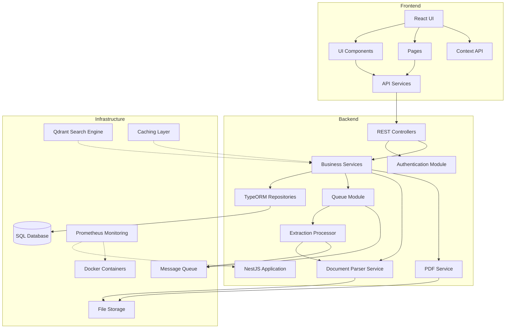
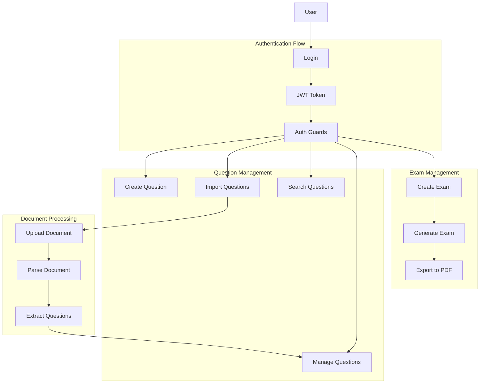
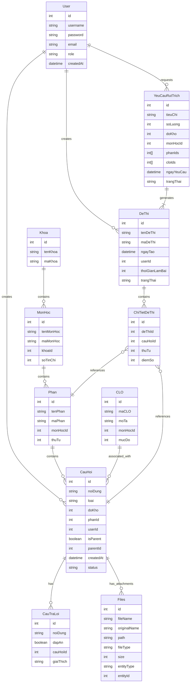
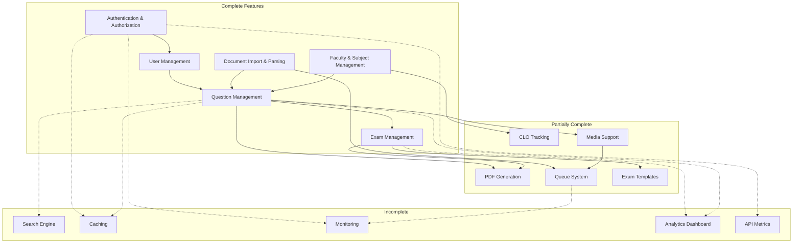
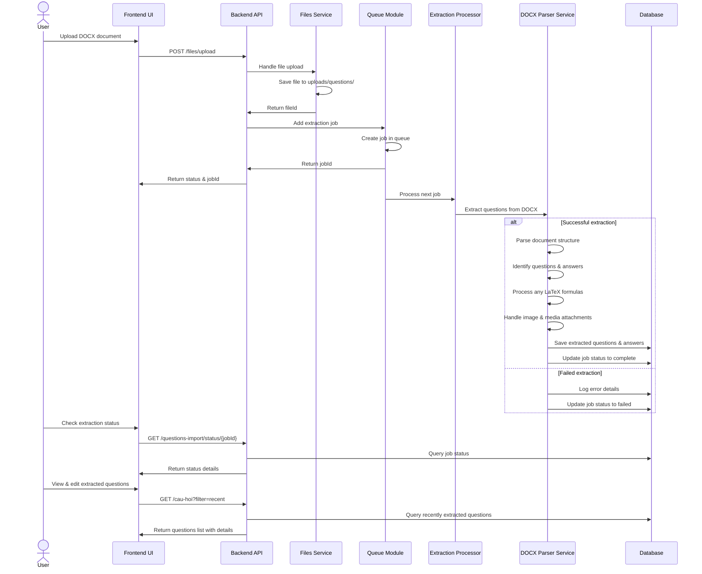
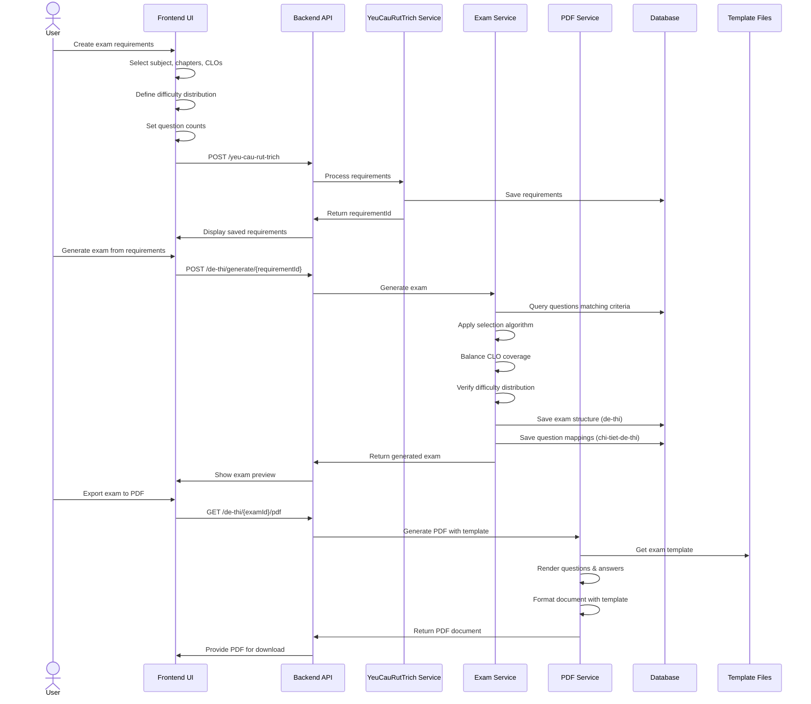
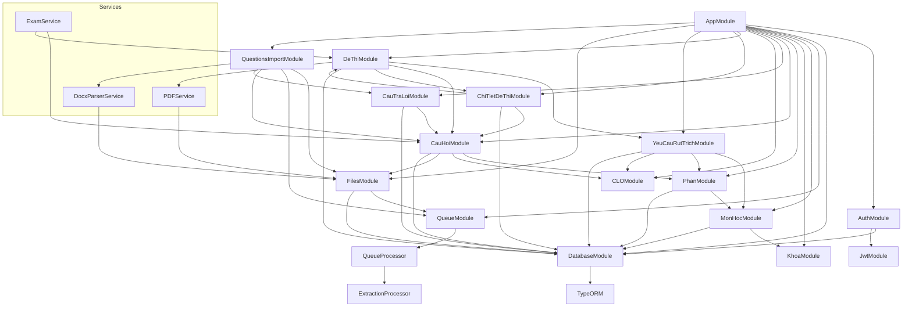
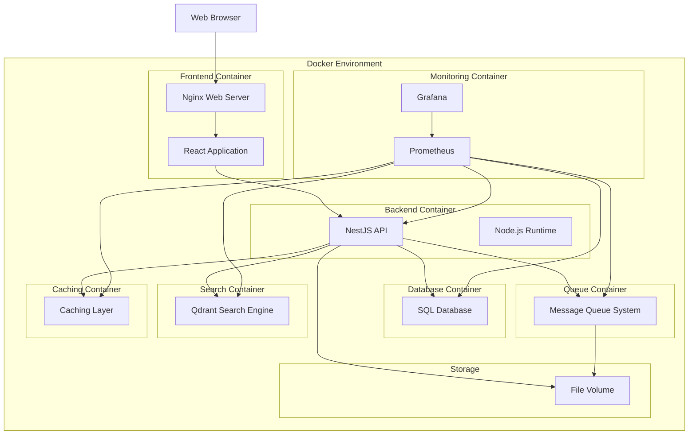

# Graduation Project Documentation

## Technologies Used

**Backend:**
- NestJS (TypeScript) framework
- TypeORM for database operations
- Python for document parsing
- Queue system for background processing
- JWT authentication

**Frontend:**
- React with TypeScript
- Tailwind CSS
- Vite as build tool

**Infrastructure:**
- Docker for containerization
- SQL Database
- Prometheus for monitoring (planned)
- PDF generation services
- Qdrant for search (planned)
- Caching layer (planned)

## System Architecture

## Main User Flows

## Entity Relationships

## Complete & Incomplete Features

## Detailed Flow: Document Import & Question Extraction

## Detailed Flow: Exam Generation with CLO Requirements

## Module Interactions & Dependencies

## Deployment Architecture (Current & Planned)

## Project Summary

The graduation project is a comprehensive question bank and exam generation system with both completed and planned components. The system is designed around:

### Core System Components

1. **Frontend**: React application with component-based UI, page routing, context API, and responsive design

2. **Backend**: NestJS application with modules for:
   - Authentication and authorization
   - Question management
   - Exam generation
   - Document parsing
   - Faculty and subject structure
   - CLO tracking

3. **Infrastructure**:
   - SQL Database
   - Docker containerization
   - File storage
   - Message queue system
   - Planned search engine (Qdrant)
   - Planned caching and monitoring

### Key Features (Completed & Planned)

- User authentication with role-based access
- Faculty, subject, and chapter management
- Question creation and organization by type
- Document parsing to extract questions from Word files
- Exam generation based on CLO requirements
- PDF generation for exams
- Media handling for questions (audio, images)
- Queue system for background processing
- Search functionality (planned)
- Monitoring and analytics (planned)

### System Flows

1. **Authentication Flow**: User login → JWT token → Protected resources
2. **Question Management**: Create/import/search/edit questions organized by subject and chapter
3. **Document Processing**: Upload DOCX → Queue processing → Extract questions → Save to database
4. **Exam Generation**: Define requirements → Select questions → Generate exam structure → Create PDF
5. **CLO Tracking**: Link questions to CLOs → Ensure coverage in exams → Track assessment metrics
